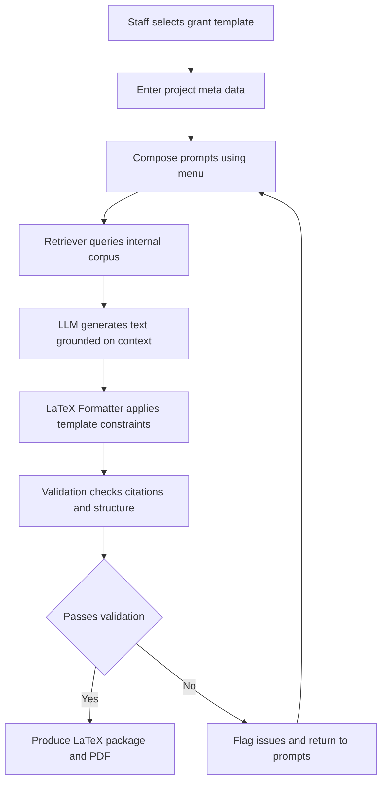
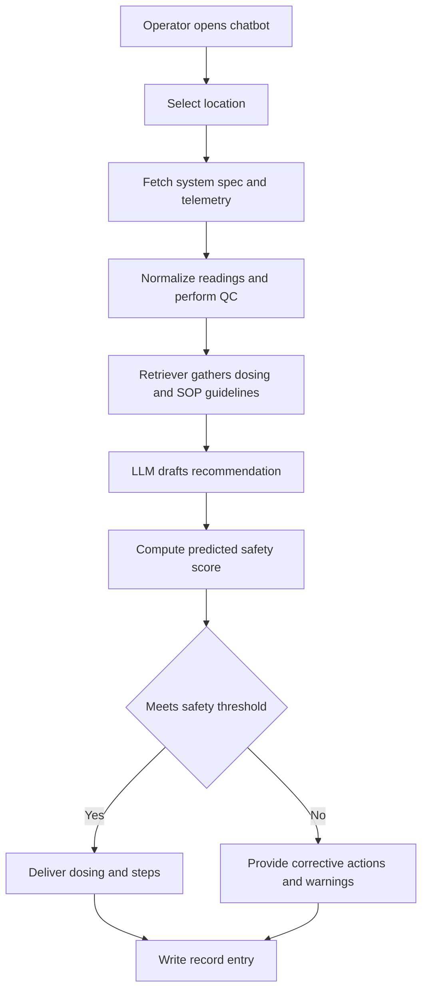
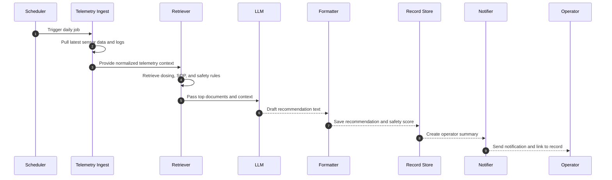
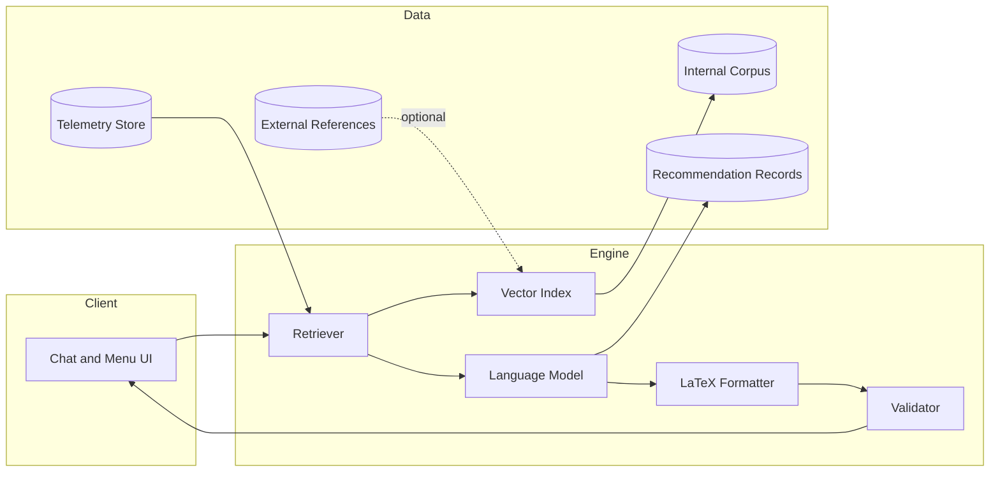
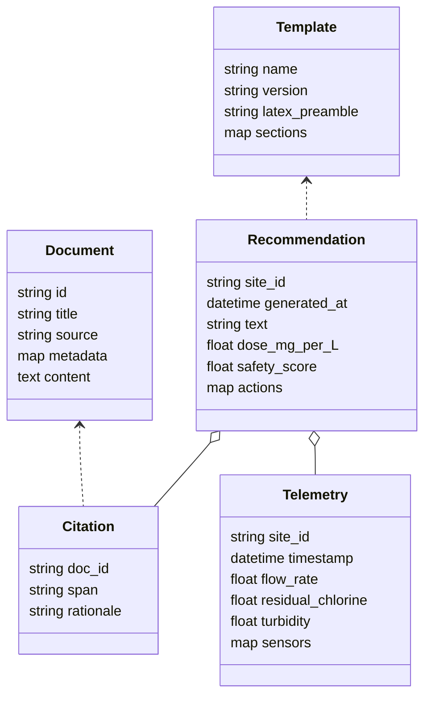
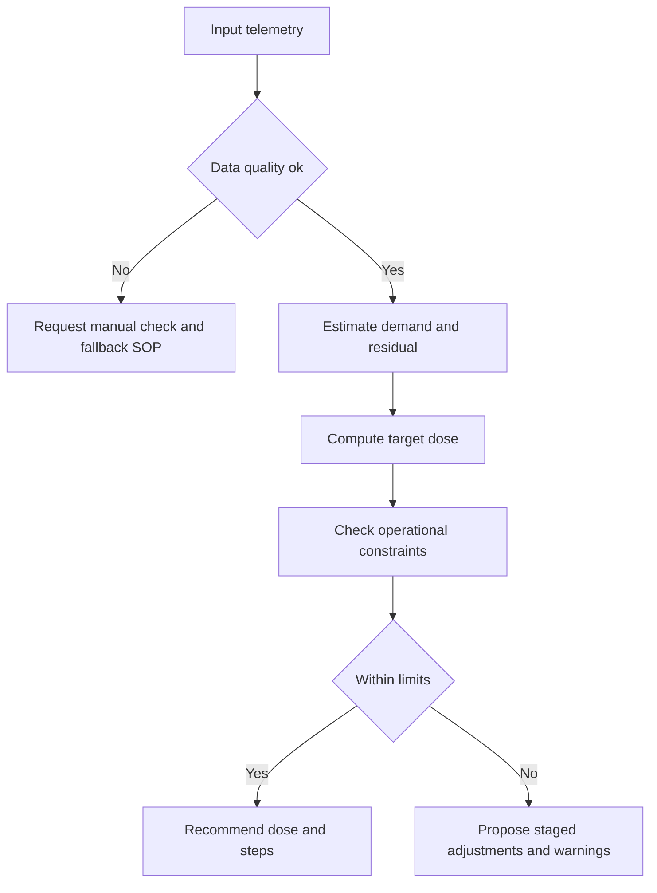
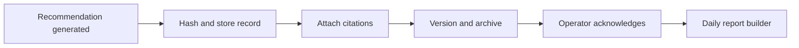

# Water Quality Technical Assistant Chatbot
_Status: Draft_

This document describes the Water Quality Technical Assistant Chatbot. It combines a prose narrative for internal and external stakeholders with technical diagrams in Mermaid that you can render on GitHub or any Mermaid-compatible viewer.

## Table of Contents
- [1. Project Overview](#1-project-overview)
- [2. Goals and Objectives](#2-goals-and-objectives)
- [3. What the System Includes](#3-what-the-system-includes)
- [4. Reference and Corpus Policy](#4-reference-and-corpus-policy)
- [5. Deployment Plan](#5-deployment-plan)
- [6. User Experience](#6-user-experience)
- [7. Automated Daily Runs](#7-automated-daily-runs)
- [8. Output Formatting and Record Keeping](#8-output-formatting-and-record-keeping)
- [9. Open Questions and Next Steps](#9-open-questions-and-next-steps)
- [10. Mermaid UML Diagrams](#10-mermaid-uml-diagrams)
  - [10.1 Internal Use Case Flow](#101-internal-use-case-flow)
  - [10.2 External Use Case Flow with Telemetry](#102-external-use-case-flow-with-telemetry)
  - [10.3 Daily Automated Run Sequence](#103-daily-automated-run-sequence)
  - [10.4 High Level Component Diagram](#104-high-level-component-diagram)
  - [10.5 Data Model Sketch](#105-data-model-sketch)
  - [10.6 Chlorine Dosing Decision Logic](#106-chlorine-dosing-decision-logic)
  - [10.7 Record and Audit Trail](#107-record-and-audit-trail)

---

## 1. Project Overview

The Water Quality Technical Assistant Chatbot is an AI-powered tool that supports water quality management with a focus on chlorination. The project serves two purposes.

**Primary purpose.** An internal tool that generates structured content for grant applications, feasibility studies, and institutional documents. It runs locally and produces outputs in standardized formats, such as LaTeX, that fit directly into our templates. The emphasis is on clarity and consistency rather than free-form text.

**Secondary purpose.** An external assistant that practitioners can use for troubleshooting and improving system performance. It provides dosing guidance and practical recommendations based on telemetry and standard operating procedures.

The internal tool comes first. The external tool builds on the same foundation once the internal workflow is working well.

---

## 2. Goals and Objectives

- Provide structured, template-aligned content for internal grant writing and reports.
- Assist external users with troubleshooting water quality devices and optimizing operations.
- Generate safe dosing recommendations for chlorine, paired with a predicted safety score and suggestions for improvements.
- Ensure that all answers are grounded in our knowledge base. Consider training a compact model on our corpus for even more reliable outputs.
- Review existing tools such as WASH AI. Take what is useful and avoid copying solutions outright. Focus on clear differentiation and value.

---

## 3. What the System Includes

**Knowledge base.** A curated collection of technical manuals, guidelines, safety procedures, and operational notes. Internal grant content is prioritized first. External references are added later as needed.

**RAG model.** The chatbot uses retrieval augmented generation. It retrieves relevant passages from the knowledge base and creates context-aware answers. For internal use it applies LaTeX templates and strict formatting. For external use it can return plain text and structured summaries.

**Telemetry integration.** For the external use case, the system ingests telemetry and setup details to tailor dosing advice and safety scoring. Operators can pick their location from a menu so the system fetches the correct data automatically.

**Validation.** The system checks that outputs follow the template and include citations when applicable. Failing checks routes the user back to refine prompts or input data.

---

## 4. Reference and Corpus Policy

**Default stance.** Internal content is grounded only in our own corpus. This reduces hallucination risk and simplifies governance and compliance.

**Optional extension.** External references may be enabled as an explicit option. If used, the system records source and citation details for transparency.

**WASH AI review.** Perform a structured review of WASH AI and similar tools. Identify strengths and gaps. Use the findings to shape features that add unique value. Do not replicate their approach without clear benefit.

---

## 5. Deployment Plan

**Phase 1. Internal tool.** Local, offline deployment. A lightweight desktop or laptop app is sufficient. No dependency on cloud services. Primary focus is grant content generation with LaTeX output.

**Phase 2. External tool.** Web or hybrid deployment that field users can access on common devices. Same core knowledge base, with added telemetry ingestion and daily recommendations.

---

## 6. User Experience

**Internal mode.** A simple, menu driven interface that lets staff choose a grant template, fill in project details, and compose prompts. The system returns LaTeX ready content that drops straight into our documents.

**External mode.** A conversational or menu based interface. The operator selects location. The system fetches telemetry and system specs, normalizes readings, retrieves relevant guidance, and then generates dosing advice, a predicted safety score, and corrective actions when needed.

---

## 7. Automated Daily Runs

For the external tool, a scheduler can run jobs once per day. The job pulls the latest logs and sensor data, uses the RAG pipeline to create recommendations, saves those results to the record store, and sends a short notification to operators.

---

## 8. Output Formatting and Record Keeping

**Internal outputs.** Constrained by LaTeX templates. Sections, headings, tables, and citations follow the template exactly so content is ready to paste or compile.

**External outputs.** Human readable text with optional structured fields such as dose in mg per L, confidence, safety score, and action items. Each recommendation is stored with a timestamp and citations for audit and later review.

---

## 9. Open Questions and Next Steps

- Prioritize internal documents for ingestion into the knowledge base.
- Complete the WASH AI review and define clear differentiators.
- Decide how telemetry will connect to the system. Confirm data fields and units.
- Choose between a pure RAG approach and a fine tuned compact model on our corpus.
- Finalize the workflow map for both internal and external modes and confirm with stakeholders.

---

## 10. Mermaid UML Diagrams

Below are diagrams that map the internal and external flows, daily automation, components, data model, dosing logic, and record keeping.

### 10.1 Internal Use Case Flow

### 10.2 External Use Case Flow with Telemetry

### 10.3 Daily Automated Run Sequence

### 10.4 High Level Component Diagram

### 10.5 Data Model Sketch

### 10.6 Chlorine Dosing Decision Logic

### 10.7 Record and Audit Trail

